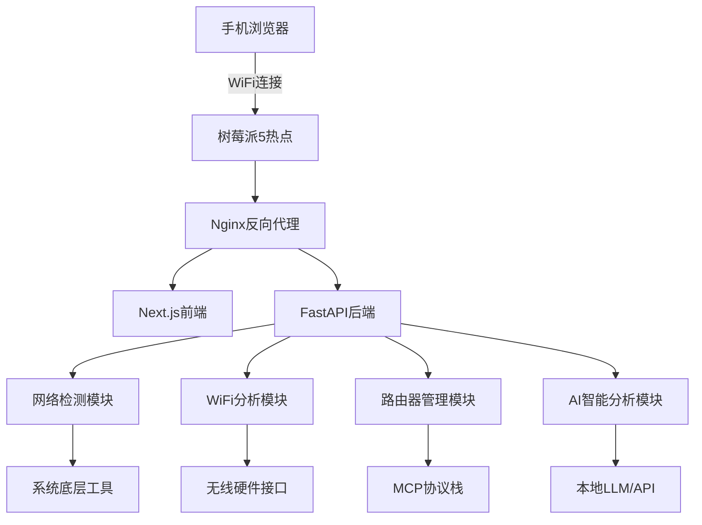

# 树莓派5网络检测工具开发计划

## 📋 项目概述

基于树莓派5的专业宽带网络检测工具，面向宽带运维人员（装维）的现场网络故障诊断需求。

### 核心功能
- 📶 WiFi信号扫描与分析
- 🌐 网络带宽测试
- 📊 实时延迟与丢包检测
- 📦 网络抓包分析
- 🤖 AI智能故障诊断
- ⚙️ 路由器自动配置优化
- 📱 移动端友好的Web界面

### 使用场景
手机连接树莓派热点 → 访问Web服务 → 通过UI操作网络检测 → 实时查看分析结果

---

## 🔧 技术栈

### 硬件平台
- **主控**: 树莓派5 (8GB内存推荐)
- **存储**: 高速MicroSD卡 (64GB+) 或SSD
- **网络**: 内置WiFi 6 + 千兆以太网

### 前端技术栈
```typescript
Next.js 14                     // App Router + 服务端渲染
React 18                       // 组件化开发
TypeScript                     // 类型安全
shadcn/ui                      // 现代化组件库
Tailwind CSS                   // 工具优先的样式框架
TanStack Query                 // 服务端状态管理
Zustand                        // 客户端状态管理
WebSocket                      // 实时通信
Recharts                       // 数据可视化
Framer Motion                  // 动画和手势
```

### 后端技术栈
```python
FastAPI                        // 现代异步Python框架
Pydantic v2                   // 数据验证和序列化
WebSocket                      // 实时通信
SQLite                         // 轻量级数据库

# 网络检测核心库
speedtest-cli                  // 带宽测试
ping3                         // 延迟和丢包检测
iperf3                        // 网络性能测试
scapy                         // 数据包分析
psutil                        // 系统资源监控

# 系统工具
iwconfig/iwlist               // WiFi信号分析
wavemon                       // 实时WiFi监控
tcpdump                       // 网络抓包
nmap                          // 网络扫描
```

### 系统服务
```bash
hostapd                       // WiFi热点
dnsmasq                       // DHCP/DNS服务
iptables                      // 网络转发规则
nginx                         // 反向代理
supervisor                    // 进程管理
```

---

## 🏗️ 系统架构



---

## 📁 项目结构

```
device-panel/
├── frontend/                  # Next.js前端应用
│   ├── app/
│   │   ├── (main)/
│   │   │   ├── dashboard/page.tsx        # 主仪表板
│   │   │   ├── wifi-scanner/page.tsx     # WiFi信号扫描
│   │   │   ├── packet-capture/page.tsx   # 网络抓包
│   │   │   ├── router-config/page.tsx    # 路由器配置
│   │   │   ├── network-test/page.tsx     # 网络测试
│   │   │   └── ai-analysis/page.tsx      # AI分析
│   │   ├── api/                          # Next.js API Routes
│   │   ├── globals.css
│   │   └── layout.tsx
│   ├── components/
│   │   ├── ui/                          # shadcn/ui组件
│   │   ├── network/                     # 网络检测组件
│   │   ├── wifi/                        # WiFi相关组件
│   │   ├── charts/                      # 实时图表
│   │   └── mobile/                      # 移动端优化组件
│   ├── hooks/
│   │   ├── useWebSocket.ts              # WebSocket连接
│   │   ├── useNetworkTest.ts            # 网络测试
│   │   └── useAIAnalysis.ts             # AI分析
│   ├── lib/
│   ├── types/
│   ├── package.json
│   ├── tailwind.config.js
│   └── next.config.js
├── backend/                   # FastAPI后端服务
│   ├── app/
│   │   ├── api/
│   │   │   ├── network/                 # 网络检测API
│   │   │   ├── wifi/                    # WiFi分析API
│   │   │   ├── router/                  # 路由器管理API
│   │   │   ├── ai/                      # AI分析API
│   │   │   └── system/                  # 系统信息API
│   │   ├── core/
│   │   │   ├── config.py               # 配置管理
│   │   │   ├── security.py             # 安全配置
│   │   │   └── websocket.py            # WebSocket管理
│   │   ├── services/
│   │   │   ├── network_service.py      # 网络检测服务
│   │   │   ├── wifi_service.py         # WiFi服务
│   │   │   ├── router_service.py       # 路由器服务
│   │   │   ├── packet_service.py       # 抓包服务
│   │   │   └── ai_service.py           # AI服务
│   │   ├── utils/
│   │   │   ├── system_tools.py         # 系统工具封装
│   │   │   └── mcp_client.py           # MCP客户端
│   │   └── main.py
│   ├── requirements.txt
│   └── Dockerfile
├── scripts/                   # 系统脚本
│   ├── install.sh             # 一键安装脚本
│   ├── setup_hotspot.sh       # 热点配置
│   ├── start_services.sh      # 启动服务
│   └── backup_config.sh       # 配置备份
├── config/                    # 配置文件
│   ├── hostapd.conf           # 热点配置
│   ├── dnsmasq.conf           # DHCP配置
│   ├── nginx.conf             # Nginx配置
│   └── supervisor.conf        # 进程管理配置
├── docs/                      # 文档
│   ├── API.md                 # API文档
│   ├── DEPLOYMENT.md          # 部署指南
│   └── USER_GUIDE.md          # 用户手册
└── README.md
```

---

## 🔍 核心功能模块

### 1. WiFi信号检测模块

```python
# services/wifi_service.py
import subprocess
import json
from typing import List, Dict

class WiFiService:
    async def scan_wifi_networks(self) -> List[Dict]:
        """扫描周边WiFi信号"""
        result = subprocess.run(['iwlist', 'wlan0', 'scan'], 
                              capture_output=True, text=True)
        networks = self._parse_wifi_scan(result.stdout)
        return networks
    
    async def get_wifi_strength_realtime(self) -> Dict:
        """实时WiFi信号强度"""
        result = subprocess.run(['iwconfig', 'wlan0'], 
                              capture_output=True, text=True)
        return self._parse_signal_strength(result.stdout)
    
    async def analyze_wifi_interference(self) -> Dict:
        """WiFi干扰分析"""
        # 使用wavemon或自定义工具分析信道干扰
        pass
```

### 2. 网络抓包分析模块

```python
# services/packet_service.py
import scapy.all as scapy
from scapy.layers.inet import IP, TCP, UDP
import asyncio

class PacketCaptureService:
    def __init__(self):
        self.capturing = False
        self.packets = []
    
    async def start_capture(self, interface: str = "wlan0", 
                          duration: int = 60) -> None:
        """开始网络抓包"""
        self.capturing = True
        
        def packet_handler(packet):
            if self.capturing:
                packet_info = self._analyze_packet(packet)
                self.packets.append(packet_info)
        
        scapy.sniff(iface=interface, prn=packet_handler, 
                   timeout=duration, store=False)
    
    def _analyze_packet(self, packet) -> Dict:
        """分析数据包"""
        info = {
            'timestamp': packet.time,
            'src': packet[IP].src if IP in packet else None,
            'dst': packet[IP].dst if IP in packet else None,
            'protocol': packet.proto if IP in packet else None,
            'size': len(packet)
        }
        return info
```

### 3. 路由器自动配置模块

```python
# services/router_service.py
import requests
import asyncio
from .ai_service import AIService

class RouterService:
    def __init__(self):
        self.ai_service = AIService()
    
    async def auto_login_router(self, router_ip: str) -> Dict:
        """AI辅助自动登录路由器"""
        router_info = await self._detect_router_model(router_ip)
        login_strategy = await self.ai_service.analyze_router_login(router_info)
        session = await self._attempt_login(router_ip, login_strategy)
        return {"success": session is not None, "session": session}
    
    async def optimize_wifi_channel(self, session, scan_data: Dict) -> Dict:
        """AI优化WiFi信道"""
        optimal_channel = await self.ai_service.recommend_wifi_channel(scan_data)
        result = await self._configure_wifi_channel(session, optimal_channel)
        return result
```

### 4. AI智能分析模块

```python
# services/ai_service.py
import openai
from .mcp_client import MCPClient

class AIService:
    def __init__(self):
        self.mcp_client = MCPClient()
        
    async def analyze_network_issues(self, test_results: Dict) -> Dict:
        """AI分析网络问题"""
        prompt = f"""
        基于以下网络检测数据，分析可能的网络问题：
        
        带宽测试: {test_results.get('speed_test', {})}
        延迟测试: {test_results.get('ping_test', {})}
        WiFi信号: {test_results.get('wifi_scan', {})}
        数据包分析: {test_results.get('packet_analysis', {})}
        
        请提供:
        1. 问题诊断
        2. 解决建议  
        3. 优化方案
        """
        
        analysis = await self.mcp_client.call_ai_analysis(prompt)
        return analysis
    
    async def recommend_wifi_channel(self, wifi_data: Dict) -> int:
        """AI推荐最佳WiFi信道"""
        prompt = f"""
        基于WiFi扫描数据: {wifi_data}
        推荐最佳的2.4G和5G信道，避免干扰。
        """
        
        recommendation = await self.mcp_client.call_ai_analysis(prompt)
        return self._parse_channel_recommendation(recommendation)
```

### 5. MCP客户端集成

```python
# utils/mcp_client.py
import asyncio
import json
from typing import Dict, Any

class MCPClient:
    def __init__(self):
        self.session = None
    
    async def call_ai_analysis(self, prompt: str) -> Dict[str, Any]:
        """调用MCP AI分析服务"""
        try:
            request = {
                "method": "ai_analyze",
                "params": {
                    "prompt": prompt,
                    "context": "network_diagnostics"
                }
            }
            
            response = await self._send_mcp_request(request)
            return response
            
        except Exception as e:
            return await self._fallback_analysis(prompt)
    
    async def _fallback_analysis(self, prompt: str) -> Dict:
        """本地分析降级方案"""
        return {"analysis": "基于规则的分析结果", "confidence": 0.7}
```

---

## 📱 前端核心组件

### 实时WiFi信号图表

```typescript
// components/wifi/WiFiSignalChart.tsx
'use client'

import { Card, CardContent, CardHeader, CardTitle } from "@/components/ui/card"
import { LineChart, Line, XAxis, YAxis, ResponsiveContainer } from 'recharts'
import { useWebSocket } from '@/hooks/useWebSocket'
import { Badge } from "@/components/ui/badge"

export function WiFiSignalChart() {
  const { data: signalData } = useWebSocket('/ws/wifi-signal')
  
  return (
    <Card className="w-full">
      <CardHeader>
        <CardTitle className="flex items-center justify-between">
          WiFi信号强度
          <Badge variant={signalData?.quality > 70 ? "default" : "destructive"}>
            {signalData?.quality}%
          </Badge>
        </CardTitle>
      </CardHeader>
      <CardContent>
        <ResponsiveContainer width="100%" height={200}>
          <LineChart data={signalData?.history || []}>
            <XAxis dataKey="time" />
            <YAxis />
            <Line type="monotone" dataKey="strength" stroke="#3b82f6" />
          </LineChart>
        </ResponsiveContainer>
      </CardContent>
    </Card>
  )
}
```

### 网络测试控制面板

```typescript
// components/network/NetworkTestPanel.tsx
import { Button } from "@/components/ui/button"
import { Card, CardContent, CardHeader, CardTitle } from "@/components/ui/card"
import { Progress } from "@/components/ui/progress"
import { Tabs, TabsContent, TabsList, TabsTrigger } from "@/components/ui/tabs"
import { useNetworkTest } from '@/hooks/useNetworkTest'

export function NetworkTestPanel() {
  const { 
    speedTest, 
    pingTest, 
    wifiScan, 
    packetCapture,
    isLoading,
    progress 
  } = useNetworkTest()

  return (
    <Card className="w-full">
      <CardHeader>
        <CardTitle>网络检测工具</CardTitle>
      </CardHeader>
      <CardContent>
        <Tabs defaultValue="speed" className="w-full">
          <TabsList className="grid w-full grid-cols-4">
            <TabsTrigger value="speed">带宽测试</TabsTrigger>
            <TabsTrigger value="ping">延迟测试</TabsTrigger>
            <TabsTrigger value="wifi">WiFi扫描</TabsTrigger>
            <TabsTrigger value="capture">抓包分析</TabsTrigger>
          </TabsList>
          
          <TabsContent value="speed" className="space-y-4">
            <Button 
              onClick={speedTest.start} 
              disabled={isLoading}
              className="w-full touch-manipulation"
              size="lg"
            >
              {isLoading ? "测试中..." : "开始带宽测试"}
            </Button>
            {isLoading && <Progress value={progress} />}
          </TabsContent>
        </Tabs>
      </CardContent>
    </Card>
  )
}
```

### AI分析结果展示

```typescript
// components/ai/AIAnalysisPanel.tsx
import { Card, CardContent, CardHeader, CardTitle } from "@/components/ui/card"
import { Badge } from "@/components/ui/badge"
import { Alert, AlertDescription } from "@/components/ui/alert"
import { Lightbulb, AlertTriangle } from "lucide-react"

interface AIAnalysisProps {
  analysis: {
    issues: string[]
    recommendations: string[]
    confidence: number
  }
}

export function AIAnalysisPanel({ analysis }: AIAnalysisProps) {
  return (
    <Card className="w-full">
      <CardHeader>
        <CardTitle className="flex items-center justify-between">
          AI智能分析
          <Badge variant="outline">
            置信度: {analysis.confidence}%
          </Badge>
        </CardTitle>
      </CardHeader>
      <CardContent className="space-y-4">
        {analysis.issues.map((issue, index) => (
          <Alert key={index}>
            <AlertTriangle className="h-4 w-4" />
            <AlertDescription>{issue}</AlertDescription>
          </Alert>
        ))}
        
        {analysis.recommendations.map((rec, index) => (
          <Alert key={index} className="border-green-200">
            <Lightbulb className="h-4 w-4" />
            <AlertDescription>{rec}</AlertDescription>
          </Alert>
        ))}
      </CardContent>
    </Card>
  )
}
```

---

## 🚀 部署配置

### 一键安装脚本

```bash
#!/bin/bash
# install.sh - 一键安装脚本

echo "=== 树莓派网络检测工具安装 ==="

# 更新系统
sudo apt update && sudo apt upgrade -y

# 安装网络工具
sudo apt install -y hostapd dnsmasq iptables-persistent
sudo apt install -y wireless-tools wavemon iperf3
sudo apt install -y tcpdump wireshark-cli nmap

# 安装Python环境
sudo apt install -y python3-pip python3-venv
pip3 install fastapi uvicorn scapy speedtest-cli

# 安装Node.js
curl -fsSL https://deb.nodesource.com/setup_18.x | sudo -E bash -
sudo apt install -y nodejs

# 配置热点
sudo ./setup_hotspot.sh

# 构建前端
cd frontend
npm install
npm run build

# 启动服务
sudo systemctl enable device-panel
sudo systemctl start device-panel

echo "=== 安装完成 ==="
echo "热点名称: NetworkTester-Pi5"
echo "热点密码: NetworkTest123"
echo "访问地址: http://192.168.4.1:3000"
```

### 热点配置脚本

```bash
#!/bin/bash
# setup_hotspot.sh

echo "配置WiFi热点..."

# 配置hostapd
cat > /etc/hostapd/hostapd.conf << EOF
interface=wlan0
driver=nl80211
ssid=NetworkTester-Pi5
hw_mode=g
channel=7
wmm_enabled=0
macaddr_acl=0
auth_algs=1
ignore_broadcast_ssid=0
wpa=2
wpa_passphrase=NetworkTest123
wpa_key_mgmt=WPA-PSK
wpa_pairwise=TKIP
rsn_pairwise=CCMP
EOF

# 配置dnsmasq
cat > /etc/dnsmasq.conf << EOF
interface=wlan0
dhcp-range=192.168.4.2,192.168.4.20,255.255.255.0,24h
address=/device-panel.local/192.168.4.1
EOF

# 配置网络接口
cat >> /etc/dhcpcd.conf << EOF
interface wlan0
    static ip_address=192.168.4.1/24
    nohook wpa_supplicant
EOF

# 启用IP转发
echo 'net.ipv4.ip_forward=1' >> /etc/sysctl.conf

# 配置防火墙规则
iptables -t nat -A POSTROUTING -o eth0 -j MASQUERADE
iptables -A FORWARD -i eth0 -o wlan0 -m state --state RELATED,ESTABLISHED -j ACCEPT
iptables -A FORWARD -i wlan0 -o eth0 -j ACCEPT

# 保存防火墙规则
sh -c "iptables-save > /etc/iptables.ipv4.nat"

echo "热点配置完成！"
```

### Nginx配置

```nginx
# config/nginx.conf
server {
    listen 80;
    server_name 192.168.4.1 device-panel.local;

    # 前端静态文件
    location / {
        proxy_pass http://localhost:3000;
        proxy_http_version 1.1;
        proxy_set_header Upgrade $http_upgrade;
        proxy_set_header Connection 'upgrade';
        proxy_set_header Host $host;
        proxy_cache_bypass $http_upgrade;
    }

    # 后端API
    location /api/ {
        proxy_pass http://localhost:8000;
        proxy_set_header Host $host;
        proxy_set_header X-Real-IP $remote_addr;
        proxy_set_header X-Forwarded-For $proxy_add_x_forwarded_for;
        proxy_set_header X-Forwarded-Proto $scheme;
    }

    # WebSocket
    location /ws/ {
        proxy_pass http://localhost:8000;
        proxy_http_version 1.1;
        proxy_set_header Upgrade $http_upgrade;
        proxy_set_header Connection "upgrade";
        proxy_set_header Host $host;
        proxy_set_header X-Real-IP $remote_addr;
        proxy_set_header X-Forwarded-For $proxy_add_x_forwarded_for;
        proxy_set_header X-Forwarded-Proto $scheme;
    }
}
```

---

## 🎯 开发里程碑

### Phase 1: 基础框架 (1-2周)
- [ ] 项目结构搭建
- [ ] 前端基础框架 (Next.js + shadcn/ui)
- [ ] 后端API框架 (FastAPI)
- [ ] 树莓派热点配置
- [ ] 基础UI组件开发

### Phase 2: 核心检测功能 (2-3周)
- [ ] 网络带宽测试
- [ ] WiFi信号扫描
- [ ] 延迟和丢包检测
- [ ] 实时数据展示
- [ ] WebSocket通信

### Phase 3: 高级功能 (2-3周)
- [ ] 网络抓包分析
- [ ] 路由器检测和登录
- [ ] AI分析模块集成
- [ ] MCP客户端开发
- [ ] 智能优化建议

### Phase 4: 优化与部署 (1-2周)
- [ ] 移动端体验优化
- [ ] 性能优化
- [ ] 系统集成测试
- [ ] 一键部署脚本
- [ ] 用户文档

---

## 📞 技术支持

### 开发环境要求
- Node.js 18+
- Python 3.9+
- 树莓派5 (8GB推荐)
- MicroSD卡 64GB+

### 相关文档
- [shadcn/ui 文档](https://ui.shadcn.com/)
- [Next.js 文档](https://nextjs.org/docs)
- [FastAPI 文档](https://fastapi.tiangolo.com/)
- [树莓派官方文档](https://www.raspberrypi.org/documentation/)

### 技术交流
- 项目GitHub仓库: (待创建)
- 技术讨论群: (待建立)

---

*最后更新: 2024年12月* 