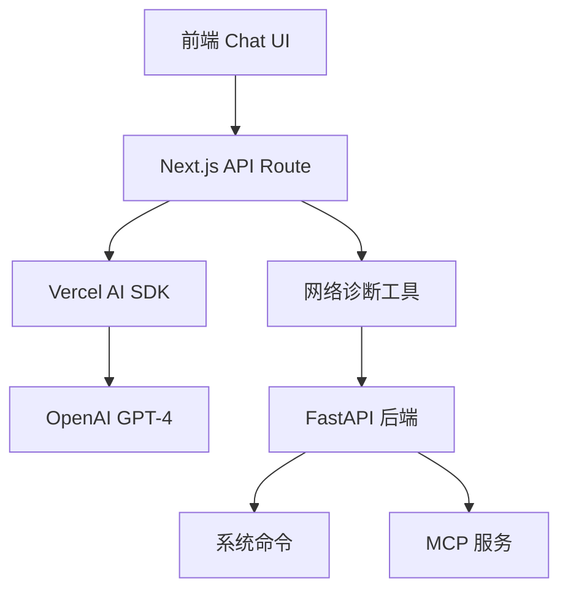

# AI 网络故障诊断 Chatbot 功能实现总结

## 📋 功能概述

本次开发完成了一个类似 ChatGPT 的智能网络故障诊断对话页面，装维人员可以通过自然语言描述故障现象，AI 助手会自动调用网络分析工具进行诊断并提供专业的解决方案。

## 🎯 核心特性

### 1. 现代化 Chatbot UI
- 基于 **Vercel AI SDK** 构建的流式对话界面
- 支持实时消息渲染和打字效果
- 工具调用过程可视化显示
- 响应式设计，移动端友好

### 2. 智能诊断能力
- **自然语言理解**: 理解装维人员描述的故障现象
- **自动工具选择**: 根据问题类型智能选择合适的诊断工具
- **思维链推理**: 提供完整的诊断思路和分析过程
- **专业建议**: 输出针对性的解决方案和优化建议

### 3. 网络诊断工具集
- **Ping 测试**: 检测网络连通性和延迟
- **速度测试**: 测试网络带宽性能
- **WiFi 扫描**: 扫描周边 WiFi 信号
- **信号分析**: 分析当前 WiFi 信号质量
- **路由追踪**: 追踪网络路径和节点

## 🏗️ 技术架构



### 前端技术栈
- **Next.js 15**: App Router + 服务端渲染
- **Vercel AI SDK**: 流式对话和工具调用
- **React 18**: 组件化开发
- **TypeScript**: 类型安全
- **shadcn/ui**: 现代化组件库
- **Tailwind CSS**: 样式框架

### 后端技术栈
- **FastAPI**: 异步 Python 框架
- **Pydantic v2**: 数据验证和序列化
- **系统工具**: ping, speedtest-cli, iwlist, iwconfig, traceroute

## 📁 项目结构

```
frontend/
├── app/
│   ├── ai-diagnosis/
│   │   └── page.tsx                    # AI 诊断主页面
│   └── api/
│       └── ai-diagnosis/
│           └── route.ts                # AI 诊断 API 路由
├── components/
│   └── ai-diagnosis/
│       ├── ChatInterface.tsx           # 聊天界面组件
│       ├── DiagnosisToolbar.tsx        # 诊断工具栏
│       └── NetworkStatusPanel.tsx      # 网络状态面板
└── hooks/
    └── useNetworkConnectivity.ts       # 网络连接状态 Hook

backend/
└── app/
    └── api/
        └── network.py                   # 网络诊断 API
```

## 🔧 实现细节

### 1. 聊天界面组件 (ChatInterface.tsx)

```typescript
// 核心功能
- 流式消息渲染
- 工具调用可视化
- 自动滚动到底部
- 输入框自适应高度
- 快捷键支持 (Enter 发送, Shift+Enter 换行)
```

### 2. AI 诊断 API (route.ts)

```typescript
// 核心功能
- 集成 Vercel AI SDK streamText
- 定义网络诊断工具描述
- 实现工具调用逻辑
- 错误处理和降级方案
- 流式响应支持
```

### 3. 网络诊断后端 (network.py)

```python
# 新增 API 端点
POST /api/network/ping_test      # Ping 测试
POST /api/network/speed_test     # 速度测试  
POST /api/network/wifi_scan      # WiFi 扫描
POST /api/network/signal_analysis # 信号分析
POST /api/network/trace_route    # 路由追踪
```

## 🚀 功能演示

### 1. 快速诊断
- 点击侧边栏快速诊断按钮
- 自动触发相应的诊断工具
- AI 解读结果并给出建议

### 2. 自然语言交互
```
用户: "网络很慢，经常断线，帮我看看是什么问题"
AI: 我来帮您诊断网络问题。首先让我检查一下您的网络连通性...
[自动调用 ping_test 工具]
[分析结果] 根据测试结果，我发现...
[提供解决方案] 建议您...
```

### 3. 工具链调用
- AI 根据问题描述智能选择工具
- 可视化显示工具执行过程
- 结合多个工具结果进行综合分析

## 📊 诊断工具说明

### Ping 测试
```json
{
  "host": "baidu.com",
  "packets_sent": 4,
  "packets_received": 4,
  "packet_loss": "0%",
  "avg_latency": "23ms"
}
```

### 速度测试
```json
{
  "download_speed": 45.2,
  "upload_speed": 12.8,
  "ping": 23,
  "server": "北京电信"
}
```

### WiFi 扫描
```json
{
  "networks": [
    {
      "ssid": "WiFi-Home-5G",
      "signal_strength": -35,
      "frequency": "5GHz",
      "channel": 36,
      "encryption": "WPA3"
    }
  ]
}
```

## 🔄 MCP 集成方案

### 当前实现
- 直接调用后端 API 获取诊断数据
- 模拟数据作为降级方案
- 标准化的工具调用接口

### 未来 MCP 集成
```python
# 计划集成 MCP (Model Context Protocol)
# 将网络诊断工具封装为 MCP 服务
# 提供统一的工具调用接口
# 支持工具发现和能力描述
```

## 🎨 UI/UX 特色

### 1. 专业化设计
- 网络运维风格的配色方案
- 清晰的信息层级
- 直观的状态指示

### 2. 响应式布局
- 左侧工具面板 + 右侧对话区
- 移动端自适应
- 智能内容折叠

### 3. 实时反馈
- 诊断进度指示
- 工具执行状态
- 结果可视化展示

## 🔧 错误处理

### 1. 网络工具调用失败
- 自动降级到模拟数据
- 用户友好的错误提示
- 不影响对话流程

### 2. AI 服务异常
- 错误边界处理
- 重试机制
- 状态恢复

### 3. 超时处理
- 设置合理的超时时间
- 及时反馈执行状态
- 支持任务取消

## 📈 性能优化

### 1. 流式响应
- 实时显示 AI 回复过程
- 减少用户等待时间
- 提升交互体验

### 2. 工具并发
- 支持多个工具并行执行
- 智能任务调度
- 资源池管理

### 3. 缓存策略
- 诊断结果缓存
- 减少重复调用
- 提升响应速度

## 🛠️ 部署说明

### 前端部署
```bash
cd frontend
npm run build
npm run start
```

### 后端部署
```bash
cd backend
pip install -r requirements.txt
python -m app.main
```

### 环境变量
```env
# OpenAI API
OPENAI_API_KEY=your_openai_api_key

# 后端服务地址
NEXT_PUBLIC_API_URL=http://localhost:8000
```

## 🔮 后续规划

### 1. MCP 服务集成
- 标准化工具调用协议
- 插件化的诊断能力
- 第三方工具集成

### 2. 诊断能力扩展
- 网络拓扑发现
- 安全漏洞扫描
- 性能基准测试
- 历史数据分析

### 3. 用户体验优化
- 语音输入支持
- 诊断报告导出
- 多语言支持
- 离线模式

### 4. AI 能力增强
- 本地 LLM 支持
- 专业知识库集成
- 学习用户偏好
- 智能问题推荐

## 📝 使用指南

### 1. 快速开始
1. 访问 `/ai-diagnosis` 页面
2. 点击快速诊断按钮或直接描述问题
3. 查看 AI 分析结果和建议

### 2. 常见使用场景
- **网络慢**: "网络速度很慢，帮我检测一下"
- **连接不稳定**: "WiFi 经常断线，信号不稳定"
- **特定网站访问异常**: "访问某个网站很慢，其他正常"
- **网络配置优化**: "帮我优化一下 WiFi 设置"

### 3. 诊断报告理解
- **绿色**: 状态良好，无需处理
- **黄色**: 需要关注，建议优化
- **红色**: 存在问题，需要处理

---

## 📄 技术文档

本功能完全基于现有技术栈实现，具有以下优势：

1. **成熟稳定**: 使用经过验证的开源技术
2. **易于维护**: 清晰的代码结构和注释
3. **可扩展性**: 模块化设计，便于功能扩展
4. **兼容性**: 与现有系统无缝集成

通过这个 AI 诊断功能，装维人员可以更高效地进行网络故障排查，提升工作效率和用户满意度。 