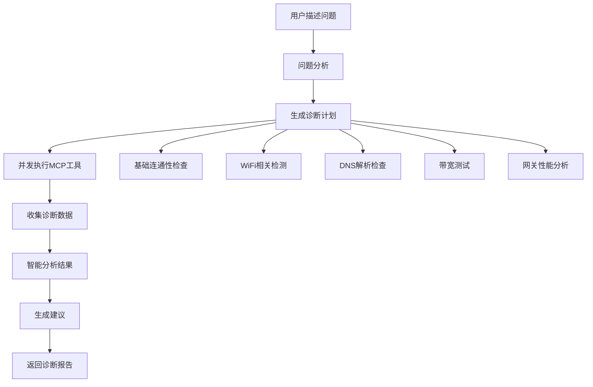

# MCP集成架构文档

## 概述

本文档描述了树莓派5网络检测工具项目中MCP (Model Context Protocol) 的集成架构，该架构使AI智能体能够调用各种网络诊断工具，提供智能化的网络故障诊断和优化建议。

## 架构设计

### 1. 整体架构图

```
┌─────────────────────────────────────────────────────────────┐
│                    AI智能体层                                │
│  ┌─────────────┐ ┌─────────────┐ ┌─────────────────────────┐  │
│  │ OpenRouter  │ │ Anthropic   │ │  其他LLM API服务         │  │
│  │   API       │ │   API       │ │                        │  │
│  └─────────────┘ └─────────────┘ └─────────────────────────┘  │
└─────────────────────────────────────────────────────────────┘
                              │
                         HTTP/API调用
                              │
┌─────────────────────────────────────────────────────────────┐
│                   FastAPI后端                               │
│  ┌─────────────────────────────────────────────────────────┐ │
│  │              MCP管理器层                                │ │
│  │  ┌─────────────┐ ┌─────────────┐ ┌─────────────────────┐ │ │
│  │  │ MCPManager  │ │ MCPClient   │ │   工具注册表         │ │ │
│  │  │             │ │             │ │                    │ │ │
│  │  └─────────────┘ └─────────────┘ └─────────────────────┘ │ │
│  └─────────────────────────────────────────────────────────┘ │
│                              │                               │
│                         JSON-RPC调用                         │
│                              │                               │
│  ┌─────────────────────────────────────────────────────────┐ │
│  │                MCP服务器层                               │ │
│  │ ┌─────────┐ ┌─────────┐ ┌─────────┐ ┌─────────┐ ┌────────┐│ │
│  │ │  Ping   │ │  WiFi   │ │ Packet  │ │Gateway │ │Connect ││ │
│  │ │ Server  │ │ Server  │ │ Server  │ │ Server │ │ Server ││ │
│  │ └─────────┘ └─────────┘ └─────────┘ └─────────┘ └────────┘│ │
│  └─────────────────────────────────────────────────────────┘ │
└─────────────────────────────────────────────────────────────┘
                              │
                        系统工具调用
                              │
┌─────────────────────────────────────────────────────────────┐
│                   树莓派5系统层                              │
│  ┌─────────┐ ┌─────────┐ ┌─────────┐ ┌─────────┐ ┌─────────┐ │
│  │  ping   │ │ iwlist  │ │tcpdump  │ │   ip    │ │speedtest│ │
│  │traceroute│ │iwconfig │ │  iw     │ │  arp    │ │   nc    │ │
│  └─────────┘ └─────────┘ └─────────┘ └─────────┘ └─────────┘ │
└─────────────────────────────────────────────────────────────┘
```

### 2. MCP服务器架构

#### 2.1 Ping服务器 (ping_server.py)
- **功能**: 网络连通性检测
- **主要工具**:
  - `ping_host`: 单主机ping测试
  - `ping_multiple_hosts`: 多主机并发ping
  - `traceroute_host`: 路由跟踪
- **底层命令**: ping, traceroute

#### 2.2 WiFi服务器 (wifi_server.py)
- **功能**: WiFi信号分析和干扰检测
- **主要工具**:
  - `scan_wifi_networks`: WiFi网络扫描
  - `get_current_wifi_info`: 当前WiFi状态
  - `analyze_wifi_interference`: 干扰分析
  - `get_wifi_channel_utilization`: 信道利用率
  - `measure_signal_strength`: 信号强度测量
- **底层命令**: iwlist, iwconfig, iw

#### 2.3 抓包服务器 (packet_server.py)
- **功能**: 网络流量分析和异常检测
- **主要工具**:
  - `capture_packets`: 数据包抓取
  - `analyze_network_traffic`: 流量分析
  - `detect_network_anomalies`: 异常检测
  - `analyze_bandwidth_usage`: 带宽分析
- **底层命令**: tcpdump, tshark

#### 2.4 网关服务器 (gateway_server.py)
- **功能**: 网关信息获取和性能分析
- **主要工具**:
  - `get_default_gateway`: 默认网关信息
  - `get_all_gateways`: 所有网关信息
  - `probe_gateway`: 网关探测
  - `analyze_gateway_performance`: 性能分析
  - `check_gateway_services`: 服务检查
- **底层命令**: ip, arp, nc, nslookup

#### 2.5 连通性服务器 (connectivity_server.py)
- **功能**: 综合网络连通性检查
- **主要工具**:
  - `check_internet_connectivity`: 互联网连通性
  - `check_dns_resolution`: DNS解析检查
  - `check_port_connectivity`: 端口连通性
  - `bandwidth_test`: 带宽测试
  - `comprehensive_connectivity_test`: 综合测试
- **底层命令**: ping, nslookup, nc, speedtest-cli

## 核心组件

### 3. MCP管理器 (MCPManager)

```python
class MCPManager:
    """MCP管理器 - 统一管理MCP客户端和服务器"""
    
    async def initialize(self, config_path: Optional[str] = None)
    async def call_tool(self, server_name: str, tool_name: str, args: Dict[str, Any])
    async def diagnose_network_issue(self, issue_description: str) -> Dict[str, Any]
    async def get_available_tools(self) -> Dict[str, Dict[str, Any]]
    async def shutdown(self)
```

**主要功能**:
- 服务器生命周期管理
- 工具调用路由
- 智能诊断编排
- 错误处理和恢复

### 4. MCP客户端 (MCPClient)

```python
class MCPClient:
    """MCP客户端类"""
    
    async def initialize(self)
    async def call_tool(self, server_name: str, tool_name: str, args: Dict[str, Any])
    async def batch_call(self, requests: List[Dict[str, Any]])
    async def get_server_status(self, server_name: str)
    async def restart_server(self, server_name: str)
```

**主要功能**:
- stdio/http传输协议支持
- JSON-RPC 2.0通信
- 并发请求管理
- 服务器状态监控

### 5. 配置管理 (MCPConfig)

```json
{
  "servers": {
    "ping": {
      "name": "ping",
      "description": "Ping网络连通性检测服务",
      "transport": "stdio",
      "command": "python",
      "args": ["-m", "app.mcp.servers.ping_server"],
      "timeout": 30,
      "enabled": true
    }
  },
  "global_timeout": 60,
  "max_concurrent_requests": 10,
  "log_level": "INFO"
}
```

## AI集成

### 6. AI诊断服务集成

#### 6.1 增强分析接口
```python
@router.post("/analyze")
async def analyze_network_results(request: AnalysisRequest):
    # 使用MCP工具增强分析能力
    enhanced_analysis = await _enhance_analysis_with_mcp(request.test_results)
    # 生成智能分析报告
```

#### 6.2 智能诊断接口
```python
@router.post("/diagnose")
async def diagnose_network_issue(request: DiagnosisRequest):
    # 基于问题描述进行智能诊断
    diagnosis_result = await mcp_manager.diagnose_network_issue(
        request.issue_description
    )
```

#### 6.3 聊天式诊断接口
```python
@router.post("/chat")
async def ai_chat_diagnosis(request: ChatRequest):
    # AI对话式网络诊断
    # 集成LLM API和MCP工具
```

### 7. 智能诊断流程



## 部署和使用

### 8. 安装依赖

```bash
# 安装MCP相关依赖
pip install mcp fastmcp

# 安装系统工具
sudo apt-get install iputils-ping traceroute wireless-tools iw tcpdump netcat-traditional speedtest-cli
```

### 9. 配置权限

```bash
# 为tcpdump和iwlist等命令配置sudo权限
echo "pi ALL=(ALL) NOPASSWD: /usr/bin/iwlist, /usr/bin/iw, /usr/sbin/tcpdump" >> /etc/sudoers.d/network_tools
```

### 10. 启动服务

```python
# 在FastAPI应用中自动初始化
@asynccontextmanager
async def lifespan(app: FastAPI):
    await mcp_manager.initialize()
    yield
    await mcp_manager.shutdown()
```

### 11. API调用示例

#### 11.1 智能诊断
```bash
curl -X POST "http://localhost:8000/api/ai/diagnose" \
  -H "Content-Type: application/json" \
  -d '{
    "issue_description": "WiFi连接经常断开，网速很慢",
    "user_reported_symptoms": ["断网", "慢"]
  }'
```

#### 11.2 聊天式诊断
```bash
curl -X POST "http://localhost:8000/api/ai/chat" \
  -H "Content-Type: application/json" \
  -d '{
    "messages": [
      {"role": "user", "content": "我的网络很慢，请帮我诊断"}
    ]
  }'
```

#### 11.3 获取可用工具
```bash
curl "http://localhost:8000/api/ai/tools"
```

## 技术特点

### 12. 核心优势

1. **标准化协议**: 使用MCP标准协议，确保兼容性
2. **模块化设计**: 每个诊断功能独立成服务器
3. **并发处理**: 支持多工具并发执行
4. **智能编排**: 根据问题描述智能选择诊断工具
5. **错误恢复**: 服务器异常时自动重启
6. **轻量级**: 针对树莓派优化，资源占用少

### 13. 扩展性

- **新增MCP服务器**: 简单创建新的诊断服务器
- **自定义工具**: 封装任何命令行工具为MCP工具
- **LLM集成**: 支持不同的大语言模型API
- **传输协议**: 支持stdio和HTTP两种通信方式

### 14. 安全考虑

- **权限控制**: 最小权限原则，只授权必要的系统命令
- **输入验证**: 所有MCP工具参数严格验证
- **日志审计**: 详细记录所有诊断操作
- **资源限制**: 防止资源滥用和DoS攻击

## 故障排除

### 15. 常见问题

1. **MCP服务器启动失败**
   - 检查Python环境和依赖
   - 验证系统工具权限
   - 查看日志文件

2. **工具调用超时**
   - 调整配置文件中的超时设置
   - 检查网络状况
   - 验证命令行工具可用性

3. **权限不足**
   - 配置sudo权限
   - 检查文件系统权限
   - 验证用户组设置

### 16. 日志配置

```python
logging.basicConfig(
    level=logging.INFO,
    format='%(asctime)s - %(name)s - %(levelname)s - %(message)s',
    handlers=[
        logging.FileHandler('/var/log/network_tools/mcp.log'),
        logging.StreamHandler()
    ]
)
```

## 总结

本MCP集成架构为树莓派网络检测工具提供了强大的AI增强能力，通过标准化的MCP协议实现了灵活、可扩展的智能诊断系统。该架构不仅支持现有的网络诊断需求，还为未来的功能扩展奠定了坚实基础。 